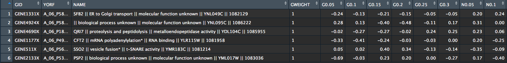
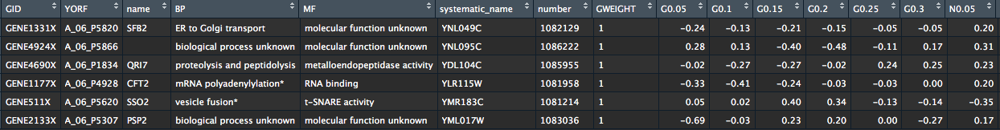
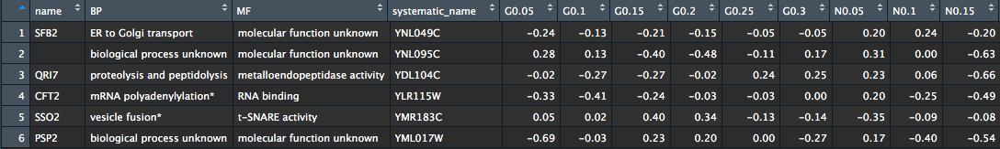

# Introduction


## Data transformation

* Visualization is an important tool for insight generation, but it is rare that you get the data in exactly the right form you need. Often you will need to...
    - `Organize` your data
    - `Pick` observations and variables
    - `Aggregate` variables
	- Create `new variables` or `summaries`
	- `Rename` the variables or `reorder` the observations

* You could do data manipulation using tradicional R commands but package `dplyr` makes it easier !

* * *

## Clearing concepts (Names)

| Day | Sample 1 | Sample 2 | Sample 3 |
|-----|:--------:|:--------:|:--------:|
| 1   |   100    |    120   |   89     |
| 2   |   50    |    30   |   55     |
| 3   |   25    |    10   |        |

```{r, echo=FALSE, warning=FALSE, include=FALSE}
library(dplyr)
library(tidyr)
```

```{r, echo=TRUE}

day <- c(1, 5, 10)
sample1 <- c(100, 50, 25)
sample2 <- c(120, 30, 10)
sample3 <- c(89, 55, NA)

dfmessyWrongName <- data.frame("Day"=day, "Sample 1"=sample1, "Sample 2"=sample2, "Sample 3"=sample3)
```
```{r, echo=FALSE}
knitr::kable(
  dfmessyWrongName
)
```

* * * 

## Clearing concepts (Names)

| Day | Sample 1 | Sample 2 | Sample 3 |
|-----|:--------:|:--------:|:--------:|
| 1   |   100    |    120   |   89     |
| 2   |   50    |    30   |   55     |
| 3   |   25    |    10   |        |

```{r, echo=TRUE}


dfmessy <- data.frame("Day"=day, "Sample_1"=sample1, "Sample_2"=sample2, "Sample_3"=sample3)


```

```{r, echo=FALSE}
knitr::kable(
  dfmessy, 
  caption = "Names with non-space characters."
)
```


* * *

## Question

Could you make a plot with Day in *x-axis* and **all** Samples measurements in *y-axis*?

* * *

## Solution?

```{r}

plot(dfmessy$Day, dfmessy$Sample_1, xlab='Day', ylab='Measurement (mg)', col='red',pch=19)
points(dfmessy$Day, dfmessy$Sample_2, col='black',pch=19)
points(dfmessy$Day, dfmessy$Sample_3, col='green',pch=19)

```


* * *

## Clearing concepts (Messy vs Tidy)

- A dataset is a collection of values (numbers, strings).
- Every value belongs to a variable and an observation.
- A variable contains all values that measure the same underlying attribute (like height, weight, temperature, duration).
- An observation contains all values measured on the same unit (like a individual, a sample, or a day, or a city).

{.shadow width=70%}

* * *

## Clearing concepts (ex Tidy)

```{r, echo=FALSE}

dftidy <- gather(dfmessy, Sample_1, Sample_2, Sample_3, key = 'samples', value='measurement')


```

{.shadow width=70%}

* * *

# How to Tidy Data

- Reshape your data to answer your questions with `tidyr` package.
- In a Tidy data:
    * Each variable must have its own column.
    * Each observation must have its own row.
    * Each value must have its own cell.

* What are our variables ?

    >- [Day]{.red-bg} [Samples]{.red-bg} [Measurements]{.red-bg}   
    
* What are our observations ?

    >- Sample_1 in day 1, Sample_1 in day 2, Sample_1 in day 3 and so on..

```{r, echo=FALSE}
knitr::kable(
  dfmessy
)
```

* * *

## Gathering

- Gathering:  some of the column names are not names of variables, but _values_ of a variable.

```{r, echo=FALSE}
library(nycflights13)
```

```{r, warning=FALSE}
library(tidyr)
```

```{r}
gather(dfmessy, Sample_1, Sample_2, Sample_3, key = 'Samples', value = 'Measurements')
```

* * *

## Better Solution

```{r}
plot(dftidy$Day, dftidy$measurement, xlab='Day', ylab='Measurement (mg)',col=as.factor(dftidy$samples), pch=19)
```

* * * 

## When things become interesting

- [Brauer 2008](http://www.molbiolcell.org/content/19/1/352.abstract) used microarrays to test the effect of starvation and growth rate on S. *cerevisiae*
- Control the growth rate restricting the feeding of a nutrient to the medium using a chemostat
- For example, you could limit the yeast's supply of leucine (an essential amino acid)
- **6** nutrients (glucose-G, ammonium-N, phosphate-P, sulfate-S, leucine-L or uracil-U )
- **6** dilution rates ranging from $~0.05\ h^{-1}$ (doubling time of about 14h) to more than $0.3\ h^{-1}$ (double time of about 2h)

```{r, warning=FALSE}
library(readr)
original_data <- read_delim("http://varianceexplained.org/files/Brauer2008_DataSet1.tds", delim = "\t")
```

```{r, echo=TRUE, eval=FALSE}
View(head(original_data))
```

* * *

## Exploring Expression Dataset

```{r echo=FALSE, eval=FALSE}

str(as.data.frame(original_data))

```

* What do we have in each column ?

{.shadow width=80%}

* * *

## Multiple Variables stored in one Column

```{r}
original_data$NAME[1:3]
```

- The `NAME` column contains lots of information
    - Gene name
    - Biological process
    - Molecular function
    - Systematic ID
    - Another ID number

* * *

# Separate

- Syntax 1:

|       [separate(]{.red .monospace}[\<name of the data frame\>]{.blue .monospace}[,]{.red .monospace}[ \ \<name of the variable (without quotes) to separate\>]{.blue .monospace}[,]{.red .monospace}[ \ \< vector with new variable names\>]{.blue .monospace}[,\ sep=]{.red .monospace}[ \ separator]{.blue .monospace}[)]{.red .monospace} 
|

```{r}
cleaned_data <- separate(original_data, NAME, c("name", "BP", "MF", "systematic_name", "number"), sep="\\|\\|")
```

- Syntax 2:

| `DATAFRAME` [\%>\%]{.red .monospace} [separate(]{.red .monospace}[ \ \<name of the variable (without quotes) to separate\>]{.blue .monospace}[,]{.red .monospace}[ \ \< vector with new variable names\>]{.blue .monospace}[,\ sep=]{.red .monospace}[ \ separator]{.blue .monospace}[)]{.red .monospace} 
|

```{r}
cleaned_data <- original_data %>% separate(NAME, c("name", "BP", "MF", "systematic_name", "number"), sep="\\|\\|")
```

- Observations:
    - `dplyr` functions never modify their inputs
    - Either print the result of save to a variable

* * *

# The pipe: `%>%`

- Free us from creating intermediate objects

- Useful to concatenate multiple operations

{.shadow width=75%}

* * *

# Selecting columns with `select()`

- Narrowing in on the variables (columns) you`re interested in
- Allows you to select specific variables (columns)

- Syntax:

|       [select(]{.red .monospace}[\<name of the data frame\>]{.blue .monospace}[,]{.red .monospace}[ \ \<name of columns\>]{.blue .monospace}[)]{.red .monospace} 
|

```{r eval=FALSE}
# Select columns by name: name, BP, MF, systematic_name

select(cleaned_data, name, BP, MF, systematic_name)

# Select all columns between name and systematic_name (inclusive)

select(cleaned_data, name:systematic_name)

# Select all columns except number and GWEIGHT

select(cleaned_data, -number, -GWEIGHT)

```

* * *

## Exercise

1. Create a new dataframe from `cleaned_data` with all variables except number, GID, YORF and GWEIGHT. Save it in a new object called `cleaned_data_new`.

* * *

## Solution

```{r}

(cleaned_data_new <- cleaned_data %>% select(-number, -GID, -YORF, -GWEIGHT))

```

* * *

## Organize our data

* Is it in a tidy or a messy shape ?

{.shadow width=70%}

* * *

## Gathering


1. Identify the variables which must be gathered resulting in a tidy data frame. Tip: select columns between with operator `:`

```{r eval=FALSE}
gather( <put variables here> , key="sample", value="expression")
```

* * *

## Gathering all together

```{r}
cleaned_data <- original_data %>%
                separate(NAME, c("name", "BP", "MF", "systematic_name", "number"), sep="\\|\\|") %>%
                select(-number, -GID, -YORF, -GWEIGHT) %>%
                gather(G0.05:U0.3, key="sample", value="expression")
cleaned_data
```

```{r, echo=FALSE}
knitr::kable(
  head(cleaned_data)
)

```

* * *

## Rename a column

```{r}

rename(cleaned_data, gene_name = name)

```

* * *

# Filter rows with `filter()`

- Subset observations based on their values.
- Syntax:

|       [filter(]{.red .monospace}[\<name of the data frame\>]{.blue .monospace}[,]{.red .monospace}[ \ \<argument(s) that filter the data frame\>]{.blue .monospace}[)]{.red .monospace} 
|

```{r}
filter(cleaned_data, BP == " mRNA polyadenylylation* ")
```

- Note the whitespaces at the start and end of some of the columns, which is inconvenient

* * *

# Removing Whitespaces

- Whitespaces at the start and end of some of the columns, which is inconvenient

```{r}
head(cleaned_data$BP)
```

```{r}
cleaned_data <- cleaned_data %>% mutate_each(funs(trimws), name:systematic_name)
```

```{r echo=FALSE}
head(cleaned_data$BP)
```

* * *

## Back to Filter

- Filter the genes involved in leucine biosynthesis (Biological Process) with expression level grater than 1.0

```{r}
filter(cleaned_data, BP=="leucine biosynthesis", expression > 1.0)
```

* * *

## One more step to clean our data

- Separate to create two new variables from information in sample column.

```{r}
cleaned_data <- cleaned_data %>% separate(sample, c("nutrient", "rate"), sep=1, convert=TRUE)

head(cleaned_data)
```

* * *

## Use Logical Operators

- Which one of the following commands should we use to find all genes are involved in `mRNA polyadenylylation*` and have RNA binding activity?

```{r eval=FALSE}
filter(cleaned_data, BP == "mRNA polyadenylylation*" & MF == "RNA binding")
```

```{r eval=FALSE}
filter(cleaned_data, BP == "mRNA polyadenylylation*" | BP == "RNA binding")
```

* * * 

## Logical Operators

{.shadow width=70%}

* * *

## Missing Values

- R reports not available information as `NA`
- It can be "contagious" to analysis
    - Suppose we want to calculate the mean expression of all genes
        
        `> mean(cleaned_data$expression)`
        
    >- However, we get this message: [NA]{.red-bg}    
- We have to handle `NAs`
    - default to dplyr is to ignore them
    - would like to know how many NAs?
        >- Ex: filter(cleaned_data,  `is.na(expression)` )

* * *

# Adding columns with `mutate()`

- Add new columns that are functions of existing columns
- Syntax:

|       [mutate(]{.red .monospace}[\<name of the data frame or nothing if using pipe\>]{.blue .monospace}[,]{.red .monospace}
|       [ \ \<name of new column\>]{.blue .monospace}[=]{.red .monospace}[\<operation on existing columns\>]{.blue .monospace}[,]{.red .monospace} 
|       [ \ \<name of another new column\>]{.blue .monospace}[=]{.red .monospace}[\<another operation on existing columns\>]{.blue .monospace}[)]{.red .monospace} 
|

```{r eval=FALSE}

cleaned_data %>% mutate(expression_brute = 2**expression) %>% select(expression , expression_brute)

```

- Useful creation functions:
  * Arithmectic operators: `+`, `-`, `/`, `*`
  * Logs: `log2()`, `log10()`
  * Ranking:

```{r}
	  y <- c(1,2,2,NA,4,3)
	  min_rank(y)
```

* * *

# Sorting rows with `arrange()`

- Order rows in a data frame

1. In ascending order by one or more columns (variables):

```{r eval=FALSE}
arrange(cleaned_data, expression)
```

2. Use `desc()` to re-order in descending order:

```{r eval=FALSE}
arrange(cleaned_data, desc(expression))
```


* * *

## Exercise

1. Find the 10 most expressed genes when restricted by nutrient leucine (L).

* * *

## Exercise

1. Find the 10 most expressed genes when restricted by nutrient leucine (L).

```{r}

top10 <- cleaned_data %>% filter(nutrient == "L") %>%
                              arrange(desc(expression))

top10_leu <- top10[1:10,]
top10_leu
```

* * *

# Summarizing data with `summarise()`

- Collapses a data frame to a "single row"
- Syntax:

|       [summarise(]{.red .monospace}[\<name of the data frame or nothing if using pipe\>]{.blue .monospace}[,]{.red .monospace}
|       [ \ \<name of new column\>]{.blue .monospace}[=]{.red .monospace}[\<summarised value\>]{.blue .monospace}[)]{.red .monospace} 
|
|

```{r}
summarise(cleaned_data, mean_expression = mean(expression, na.rm = TRUE))
```

- We can use function `n()` to count the number of observations

```{r}
summarise(cleaned_data, mean_expression = mean(expression, na.rm = TRUE), count = n())
```

* * *

- Powerfull when paired with `group_by()`
    * This changes the unit of analysis from the complete dataset to individual groups
    * Example: 

```{r}
# The exactly above code applied to a data frame grouped by nutrient and rate, 
# we get the average delay per date
cleaned_data %>% 
  group_by(nutrient, rate) %>%
    summarise(mean_expression_by_rate = mean(expression, na.rm = TRUE), count = n())

```

* * *

## Summary functions

- Measures of location: `mean()`, `median()`
- Measures of spread: `sd()`
- Measures of rank: `min()`, `max()`
    - Example: the most and least expression values?
    
    
```{r eval=FALSE}
cleaned_data %>%
  group_by(nutrient, rate) %>% 
    summarise(
      least_expr = min(expression),
      most_expr = max(expression)
    )
```

* * *

## Summary functions

- Measures of location: `mean()`, `median()`
- Measures of spread: `sd()`
- Measures of rank: `min()`, `max()`
    * Example: the most and least expression values?
    * First we have to filter the missing values !

```{r eval=FALSE}
cleaned_data %>%
  filter(!is.na(expression)) %>%
  group_by(nutrient, rate) %>% 
    summarise(
      least_expr = min(expression),
      most_expr = max(expression)
    )
```

* * *

```{r, echo=FALSE, warning=FALSE}
library(ggplot2)
```

```{r}
cleaned_data %>%
        filter(BP == "leucine biosynthesis") %>%
        ggplot(aes(rate, expression, color = nutrient)) +
        geom_point() +
        geom_line() +
        facet_wrap(~name)
```

* * *

# Take home message

- `dplyr` and `tidyr` functions to manipulate your data:
  - `gather()`
  - `separate()`
  - `filter()`
  - `select()`
  - `mutate()`
  - `arrange()`
  - `summarise()`
  
* * *

## Bibliography

http://varianceexplained.org/r/tidy-genomics/

http://r4ds.had.co.nz/transform.html

* * *