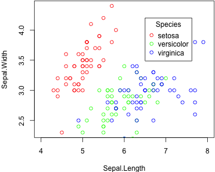
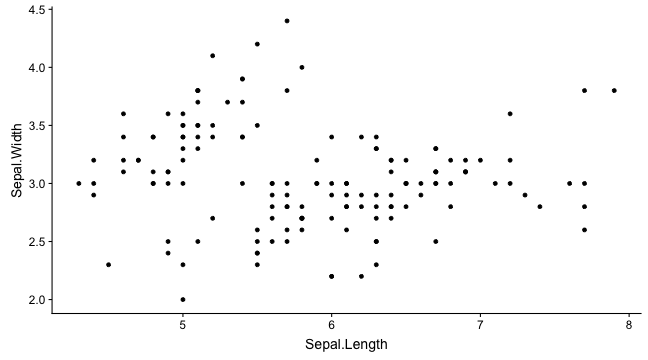
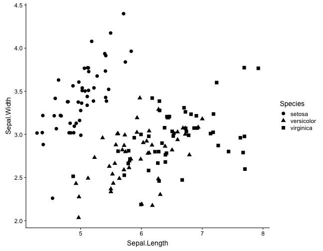
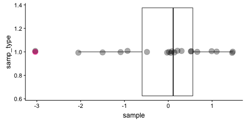
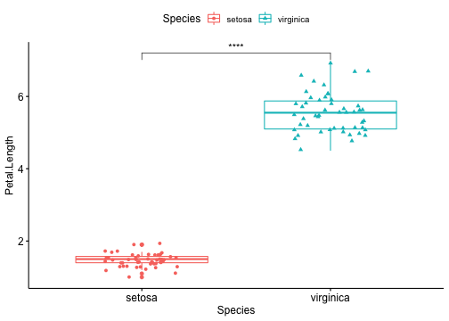

<style>
em {
  font-style: italic
}

strong {
  font-weight: bold;
}
sup {
  top: -0.5em;
  vertical-align: baseline;
  font-size: 75%;
  line-height: 0;
  position: relative;
}
#flex pre {
  display: flex;
  overflow: auto;
  flex-flow: row nowrap;
}
#new {
    text-align: right;
    color: red;
}
#new h2 {
    color: red;
}
.title-slide hgroup > h1{
  font-family: 'Economica', sans-serif;
}
slide:not(.segue) h2{
  font-family: 'Economica', sans-serif;
}
.segue h2{
  font-family: 'Economica', sans-serif;
}
mark {
    background-color: yellow;
    color: black;
}
</style>

--- {bg: yellow}

## Outline

2. Rationale behind ggplot2
3. "Hello World" Plot
4. Basic Template
5. Themes
6. Aggregating Aesthetics
7. Line Plots
8. Faceting 
9. Histograms
10. Scales
11. Box Plot
12. ggpubr
13. Saving Plots


--- .segue

# Rationale behind ggplot2

--- &twocol .class #flex

## R base vs ggplot2 ##

Comparison for simple graphs:

*** =left


```r
hist(iris$Sepal.Width)
```


*** =right


```r
ggplot(data = iris) + 
    geom_histogram(mapping = aes(x = Sepal.Width), binwidth = 0.25) + theme_classic()
```


--- &twocol .class #flex

## R base vs ggplot2 ##

Comparison for complex graphs:

*** =left


```r
par(mar = c(4,4,.1,.1))
plot(Sepal.Width ~ Sepal.Length, data = subset(iris, Species == "setosa"), col = "red", xlim = c(4, 8))
points(Sepal.Width ~ Sepal.Length, col = "green", data = subset(iris, Species == "versicolor"))
points(Sepal.Width ~ Sepal.Length, col = "blue", data = subset(iris, Species == "virginica"))
legend(6.5, 4.2, c("setosa", "versicolor", "virginica"), title = "Species", col = c("red", "green", "blue"), pch=c(1,1,1))
```



*** =right


```r
ggplot(data = iris) +
    geom_point(mapping = aes(x = Sepal.Length, y = Sepal.Width, colour = Species))
```


---

## Why ggplot2

- Based on the Grammar of Graphics (Wilkinson, 2005)

- It can be difficult so Forget your preconceptions from other graphics tools

- ggplot2 is designed to work iteratively
   
- What is the grammar of graphics?
    - is an answer to a question: what is a statistical graphic?

*** =pnotes

- You are not limited to a set of pre-specified graphics, you can create new graphics that are precisely tailored for your problem
 - you can start with a layer showing the raw data then add layers of annotations and statistical summaries
    - adding themes is useful to focus on graphics that best reveals the messages in your data
    - In brief, the gram- mar tells us that a statistical graphic is a mapping from data to aesthetic attributes (colour, shape, size) of geometric objects (points, lines, bars). The plot may also contain statistical transformations of the data and is drawn on a specific coordinate system. Facetting can be used to generate the same plot for different subsets of the dataset. It is the combination of these independent components that make up a graphic.
    
---

## What is a graphic?

- **Data** that you wish to visualise and a set of aesthetic mappings describing how variables in the data are mapped to aesthetic attributes that you can perceive.
- **Layers** made of geometric objects. What you really see.. positions, points, lines, polygons..
- **Scales** draw axis and legends.. 
- **Coordinate system** like cartesian or polar coords.
- **faceting** create multiple plots easily
- **theme**

---

## 3 Key Components

1. **data**, in <mark>data.frame form</mark>
2. A set of **aesthetic mappings** between variables in the data and visual properties.. position, color, line type?, and
3. At least one **geom** to speficy what people see.. points? lines? bars?

</img>

*** =pnotes

TOME: explicar terminologias, isto eh, o que cada funcao realiza. Tipo ggplot eh a funcao principal onde voce especifica o dataset. 

---

## RStudio's data visualization cheatsheet

- https://github.com/rstudio/cheatsheets/raw/master/data-visualization-2.1.pdf (ggplot2-cheatsheet)

</img>

--- .segue

# "Hello World" Plot

---

## First component: **Data**

Iris dataset gives measurements (cm) of sepal and petal from three species of _Iris_.

</img>


```r
head(iris)
```

```
##   Sepal.Length Sepal.Width Petal.Length Petal.Width Species
## 1          5.1         3.5          1.4         0.2  setosa
## 2          4.9         3.0          1.4         0.2  setosa
## 3          4.7         3.2          1.3         0.2  setosa
## 4          4.6         3.1          1.5         0.2  setosa
## 5          5.0         3.6          1.4         0.2  setosa
## 6          5.4         3.9          1.7         0.4  setosa
```

--- &multitext

## Exercises

1. How many species in iris dataset ?
2. How many flowers (total) in this dataset?
3. How can you get more info about this dataset?
4. Is this dataset appropriate for a plot?

*** .explanation

1. <span class='answer'>3</span>
2. <span class='answer'>150</span>
3. <span class='answer'>?iris</span>
4. <span class='answer'>data.frame</span>

---

## Second component: **Aesthetics**

We have our 1st essential component: **Data**, <mark>in data.frame form</mark>. Which aesthetics should we mapping to?

* Suppose we wish to plot in axis x and y repectively the sepal's length and width.
  * Mapping `Sepal.Length` and `Sepal.Width` to aesthetics `x` and `y`.


```r
ggplot(data = iris, mapping = aes(x = Sepal.Length, y = Sepal.Width))
```

---


```r
ggplot(data = iris, mapping = aes(x = Sepal.Length, y = Sepal.Width))
```


<div class="alert alert-warning alert-dismissable">
  <a href="#" class="close" data-dismiss="alert" aria-label="close">&times;</a>
  <strong>Empty!</strong> Indicates that what we'll visually see isn't set. -> We don't have geometries!
</div>

---

## Last but not least: **geometry**

<div class="alert alert-info alert-dismissable">
  <a href="#" class="close" data-dismiss="alert" aria-label="close">&times;</a>
  <strong>Tip!</strong> What would be a good geometry to show this kind of data.. points, lines, bars?
</div>

- Geometry: points (`geom_point()`).


```r
ggplot(data = iris, mapping = aes(x = Sepal.Length, y = Sepal.Width)) +
  geom_point()
```

---


```r
ggplot(data = iris, mapping = aes(x = Sepal.Length, y = Sepal.Width)) +
  geom_point()
```


```r
gp <- ggplot(data = iris) +
  geom_point(mapping = aes(x = Sepal.Length, y = Sepal.Width))
gp
```



--- .segue

# To Summarize

---

## Basic Template

```Perl
ggplot(data = <DATA>) +
  geom_point(mapping = aes(<MAPPINGS>))
```

- Specify the data inside the ggplot function.
- Anything else that goes in there becomes a global setting.
- Then add layers of geometric objects.

</img>

--- .segue

# Themes

---

Do not worry about the main visual ! Use themes.


```r
gp + theme_classic()
```


---

https://github.com/jrnold/ggthemes

https://cran.r-project.org/web/packages/ggsci/vignettes/ggsci.html


```r
# install.packages("ggthemes")
library(ggthemes)
gp + theme_economist() + scale_colour_economist()
```


--- .segue

# Aggregating aesthetics

---

## Aggregating aesthetics

- To add aditional variables to a plot use other aesthetics like `colour`, `shape`, and `size`.


- These work in the same way as the `x` and `y` aesthetics.


```r
ggplot(data = iris, mapping = aes(x = Sepal.Length, y = Sepal.Width)) +
  geom_point(mapping = aes(colour = Species))
```

---


```r
ggplot(data = iris, mapping = aes(x = Sepal.Length, y = Sepal.Width)) +
  geom_point(mapping = aes(colour = Species))
```


---

- We could have mapped class to the `size` aesthetic in the same way.
- Do it!


```r
ggplot(data = iris, mapping = aes(x = Sepal.Length, y = Sepal.Width)) +
  geom_point(mapping = aes(size = Species))
```

```
## Warning: Using size for a discrete variable is not advised.
```


---

- We also could have mapped class to the `shape` aesthetic in the same way but increasing **all** the points size.
- Do it!

---


```r
ggplot(data = iris, mapping = aes(x = Sepal.Length, y = Sepal.Width)) +
  geom_point(mapping = aes(shape = Species), size = 3)
```


*** =pnotes

I need to focus on the following:

Different types of aesthetic attributes work better with different types of variables. For example, colour and shape work well with categorical variables, while size works well for continuous variables. The amount of data also makes a difference: if there is a lot of data it can be hard to distinguish different groups. An alternative solution is to use facetting...

---


```r
ggplot(data = iris, mapping = aes(x = Sepal.Length, y = Sepal.Width)) +
  geom_point(mapping = aes(shape = Species), size = 3, position = "jitter")
```



---

## Multitude of Shapes

- 25 built in shapes identified by numbers (`+ scale_shape_manual(values=<VECTOR OF SHAPES>)`)
- What's the difference between squares 0, 15 and 22?
    - 0-14 border determined by `colour`
    - 15-18 filled with `colour`
    - 21-24 border of `colour` and filled with `fill`


---

## Exercises

Q1. What's gone wrong with this code? Why are the points not blue?


```r
ggplot(data = iris, mapping = aes(x = Sepal.Length, y = Sepal.Width)) +
  geom_point(mapping = aes(colour = "blue"))
```


--- &twocol .class #flex

## Inside vs Outside parameters

- Remember that aesthetic is associated with variables - inside parameter (left plot)
- Attributes outside the mapping are general characteristics applied to the geometry (right plot)

*** =left


```r
ggplot(data = iris, mapping = aes(x = Sepal.Length, y = Sepal.Width)) +
  geom_point(mapping = aes(colour = Species))
```


*** =right


```r
ggplot(data = iris, mapping = aes(x = Sepal.Length, y = Sepal.Width)) +
  geom_point(colour = "blue")
```


---

Q2. What happens if you map an aesthetic to something other than a variable name, like `aes(colour = Sepal.Length > 7)`?


```r
ggplot(data = iris, mapping = aes(x = Sepal.Length, y = Sepal.Width)) +
  geom_point(mapping = aes(colour = Sepal.Length > 7))
```


---

Q3. Take a subset of `diamonds` dataset and reproduce the following plot:


```r
d2 <- diamonds[sample(1:dim(diamonds)[1],1000),]
```


--- .segue

# Line Plots

---

- A plot constructed with ggplot can have more than one geom
- Trends in data
- Our sepal width vs sepal length could use a linear regression


```r
ggplot(data = iris, mapping = aes(x = Sepal.Length, y = Sepal.Width)) +
  geom_point(mapping = aes(colour = Species)) + geom_smooth(method = "lm")
```


---


```r
ggplot(data = iris, mapping = aes(x = Sepal.Length, y = Sepal.Width)) +
  geom_point(mapping = aes(colour = Species)) +
    geom_smooth(method = "lm", aes(color = Species))
```


--- .segue

# Facets

---

# Faceting

- Create separate graphs for subsets of data
- Two main functions:
    - `facet_wrap()`: define subsets as the levels of a single grouping variable
    - `facet_grid()`: define subsets as the crossing of two grouping variables

```r
ggplot(data = iris, mapping = aes(x = Sepal.Length, y = Sepal.Width)) +
  geom_point(mapping = aes(colour = Species)) + geom_smooth(method = "lm", aes(color = Species)) + facet_wrap(~Species)
```


---

- Faceting along rows


```r
ggplot(data = iris, mapping = aes(x = Sepal.Length, y = Sepal.Width)) +
  geom_point(mapping = aes(colour = Species)) + 
    geom_smooth(method = "lm", aes(color = Species)) + facet_grid(. ~ Species)
```


--- .segue

# Bar chart

---

The following plot displays the total number of samples in the `iris` dataset grouped by **Species**
- x-axis displays species
- y-axis displays count (but count is not a var in `iris` dataset)


```r
ggplot(data = iris) + 
    geom_bar(mapping = aes(x = Species, fill = Species))
```


---


| Sepal.Length| Sepal.Width| Petal.Length| Petal.Width|Species |
|------------:|-----------:|------------:|-----------:|:-------|
|          5.1|         3.5|          1.4|         0.2|setosa  |
|          4.9|         3.0|          1.4|         0.2|setosa  |
|          4.7|         3.2|          1.3|         0.2|setosa  |
|          4.6|         3.1|          1.5|         0.2|setosa  |
|          5.0|         3.6|          1.4|         0.2|setosa  |
|          5.4|         3.9|          1.7|         0.4|setosa  |

---

- ggplot2 will compute new variables for our plot.


```r
?geom_bar
```

---

## Traditional bar chart

- We have the number of occurrences of a variable in variable `freq`. This will be the `y` of our plot. Attention to the parameter `stat`. We change it to `identity`.


|Species    | freq|
|:----------|----:|
|setosa     |   50|
|versicolor |   50|
|virginica  |   50|


```r
ggplot(data = iris_count) + 
    geom_bar(mapping = aes(x = Species, y=freq, fill=Species), stat = "identity")
```

---


```r
ggplot(data = iris_count) + 
    geom_bar(mapping = aes(x = Species, y=freq, fill=Species), stat = "identity")
```


---

## Exercise

Q1. Construct a histogram of any continuous variables within iris dataset (tip: take a look at ggplot2 cheatsheet and play with parameter `binwidth`)

---

## Exercise

R1.


```r
ggplot(data = iris) + geom_histogram(mapping = aes(x = Petal.Width), binwidth = 0.3)
```


---

## Error bars

- We can plug error bars into the chart. First let's tidy our data and calculate the mean and standard deviation for the length grouped by structure and Species.


```r
iris_tidy <- gather(iris, Sepal.Length:Petal.Width,
                             key="Measure_type", value="Values")
iris_sum <- iris_tidy %>% group_by(Measure_type, Species) %>%
                    summarise(m = mean(Values), sd = sd(Values))
iris_sum
```

```
## # A tibble: 12 x 4
## # Groups:   Measure_type [4]
##    Measure_type Species        m    sd
##    <chr>        <fct>      <dbl> <dbl>
##  1 Petal.Length setosa     1.46  0.174
##  2 Petal.Length versicolor 4.26  0.470
##  3 Petal.Length virginica  5.55  0.552
##  4 Petal.Width  setosa     0.246 0.105
##  5 Petal.Width  versicolor 1.33  0.198
##  6 Petal.Width  virginica  2.03  0.275
##  7 Sepal.Length setosa     5.01  0.352
##  8 Sepal.Length versicolor 5.94  0.516
##  9 Sepal.Length virginica  6.59  0.636
## 10 Sepal.Width  setosa     3.43  0.379
## 11 Sepal.Width  versicolor 2.77  0.314
## 12 Sepal.Width  virginica  2.97  0.322
```

---

So, to plot the mean with bars we need some data transformations.


```r
bar_ann <- ggplot(data = iris_sum, mapping = aes(x = structure, y = m, fill = Species)) +
  geom_bar(position = "dodge", stat = "identity") +
  geom_errorbar(mapping = aes(ymin = (m-sd), ymax = (m+sd)),
                width = .2, position=position_dodge(.9), colour='red') +
  xlab(NULL) + ylab("mean")
bar_ann
```


--- .segue

# Scales

---

## Scales

- Manually tunning your plots !
- The name is a tip for the function which a scale will apply (e.g., `scale_x_log10()`, `scale_fill_grey()`, `scale_colour_brewer()`, `scale_y_continuous()`, `scale_y_discrete()` )


```r
p <- ggplot(data = iris) + 
  geom_point(mapping = aes(x = Sepal.Length, y = Sepal.Width, colour = Species)) 
p + scale_colour_brewer()
```


---

## Colour

- http://colorbrewer2.org/


```r
p + scale_colour_brewer(palette = "YlOrBr")
```


---

## Colour

- Google it: hex colour picker 


```r
p + scale_colour_manual(values = c("#4286f4", "#1b4484", "#051a3a"))
```


---

## Guides: Legends and Axes

<figure class="figure">
  <div class="row text-center">
  
</div>
  <figcaption class="figure-caption text-right">source: ggplot UseR series by HW</figcaption>
</figure>

*** =pnotes

In ggplot2, guides are produced automatically based on the layers in your plot. This is very different to base R graphics, where you are responsible for drawing the legends by hand.

---

## Scale Title

Supply text strings (using `\n` for line breaks) or mathematical expressions in `quote()` (check in `?plotmath`)


```r
p + xlab("Sepal Length \n(cm)") + ylab("Sepal Width (cm)") + labs(colour = "Sp")
```


---

## Breaks

The breaks argument controls which values appear as tick marks on axes and keys on legends.


```r
p + scale_x_continuous( breaks = seq(4, 8, 0.5) )
```


*** =pnotes

Each break has an associated label, controlled by the labels argument. If you set labels, you must also set breaks; otherwise, if data changes, the breaks will no longer align with the labels.

---

Each break can have an associated label, controlled by the labels argument.


```r
p + scale_x_continuous( breaks = seq(4, 8, 0.5) , labels = paste(seq(4, 8, 0.5), "cm"))
```


---

## Legends and fonts

- Use italics for species in plant names.

</img>

--- .class #flex

```Perl
p <- p + scale_colour_discrete(name = "Species",
                          labels = c(expression(paste("Iris ", italic("setosa"))), 
                                     expression(paste("Iris ", italic("versicolor"))), 
                                     expression(paste("Iris ", italic("virginica"))))
```


--- .segue

# Box Plot

---

- Use box plots to illustrate the spread and differences of samples.
- $n=20$ samples from $N(0,1)$.



```
##     Min.  1st Qu.   Median     Mean  3rd Qu.     Max. 
## -3.03609 -0.59772  0.11208 -0.07907  0.56028  1.47123
```

*** =pnotes

Whereas histograms require a sample size of at least 30 to be useful, box plots require a sample size of only 5, provide more detail in the tails of the distribution and are more readily compared across three or more samples.

Box plots characterize a sample using the 25th, 50th and 75th percentiles???also known as the lower quartile (Q1), median (m or Q2) and upper quartile (Q3) - and the interquartile range (IQR = Q3 - Q1), which covers the central 50% of the data.

The use of quartiles for box plots is a well-established convention: boxes or whiskers should never be used to show the mean, s.d. or s.e.m.

Box plot construction requires a sample of at least n = 5 (preferably larger), although some software does not check for this. For n < 5 we recommend showing the individual data points.

The traditional mean-and-error scatter plot with s.e.m. or 95% CI error bars (Fig. 4b) can be incorporated into box plots (Fig. 4c), thus combining details about the sample with an estimate of the population mean. 

Because they are based on statistics that do not require us to assume anything about the shape of the distribution, box plots robustly provide more information about samples than conventional error bars.

---

## Exercises

Q1. Use the following transformation of iris data to plot a boxplot for all discreve variables (i.e. Sepal.Width, Sepal.Length, Petal.Width, Petal.Length) coloured by Species names.


```r
iris_tidy <- tidyr::gather(iris, Sepal.Length:Petal.Width,
                             key="Measure_type", value="Values")
```

---

R1.


```r
ggplot(data = iris_tidy) + 
  geom_boxplot(mapping = aes(x = Measure_type, y = Values, colour = Species)) +
  scale_x_discrete(limits = c("Petal.Width", "Sepal.Width", "Petal.Length", "Sepal.Length"))
```


---

## Labels and Paths

- Suppose we draw a box plot of Petal's length for Iris setosa and Iris virginica. We compare the mean between the two distributions by a t-test. How do we plot the significance? 


```
## 
## 	Welch Two Sample t-test
## 
## data:  iris[iris$Species == "setosa", "Petal.Length"] and iris[iris$Species == "virginica", "Petal.Length"]
## t = -49.986, df = 58.609, p-value < 2.2e-16
## alternative hypothesis: true difference in means is not equal to 0
## 95 percent confidence interval:
##  -4.253749 -3.926251
## sample estimates:
## mean of x mean of y 
##     1.462     5.552
```

Adding text to a plot can be quite **annoying**. The main tool is `geom_text()` which adds labels at specified `x` and `y` positions.

---

1.Subset the data


```r
iris_2sp <- iris %>% filter(Species == "setosa" | Species == "virginica")
head(iris_2sp)
```

```
##   Sepal.Length Sepal.Width Petal.Length Petal.Width Species
## 1          5.1         3.5          1.4         0.2  setosa
## 2          4.9         3.0          1.4         0.2  setosa
## 3          4.7         3.2          1.3         0.2  setosa
## 4          4.6         3.1          1.5         0.2  setosa
## 5          5.0         3.6          1.4         0.2  setosa
## 6          5.4         3.9          1.7         0.4  setosa
```

---

2.Plot and label


```r
boxall <- ggplot(data = iris_2sp) + 
  geom_boxplot(mapping = aes(x = Species, y = Petal.Length)) +
  ylim(c(0, 10)) + geom_segment(x = 1, xend = 2, y = 8, yend=8) +
  geom_text(x = 1.5, y = 9, label = "***", family = "mono", size=10)
boxall
```


--- .segue

# ggpubr: Publication Ready Plots

---

Features:

- automatically add p-vlues and significance levels to box plots, bar plots and more.
- arrange and annotate multiple plots on the same page.
- change graphical parameters such as colors and labels.

---


```r
library(ggpubr)
my_comparisons = list( c("setosa", "virginica") )
p <- ggboxplot(iris_2sp, x = "Species", y="Petal.Length", color="Species",
               add="jitter", shape="Species") +
        stat_compare_means(comparisons = my_comparisons, 
                           label = "p.signif", method = "t.test") 
p
```



---


```r
plabeled <- ggboxplot(iris_2sp, x = "Species", y="Petal.Length", color="Species", 
                      add="jitter", shape="Species") +
        stat_compare_means(comparisons = my_comparisons, method = "t.test",
                           label="p.format", label.y = 8) 
plabeled
```


---

## Bar chart with error bars


```r
ggbarplot(iris_tidy, x = "Measure_type", y = "Values", color = "Species", 
          add=c("mean_sd"), palette = "jco", position = position_dodge(0.9), ylab="mean")
```


--- .segue

# Saving Plots

---

- If the plot is on your screen

```
ggsave("~/path/to/figure/filename.png")
```

- If your plot is assigned to an object

```
ggsave(plot1, file = "~/path/to/figure/filename.png")
```

- Specify a size

```
ggsave(plot1, file = "~/path/to/figure/filename.png", width = 6,
        height = 4)
```

- Or any format (pdf, png, eps, svg, jpg)

```
ggsave("~/path/to/figure/filename.eps")
ggsave("~/path/to/figure/filename.svg")
ggsave("~/path/to/figure/filename.pdf")
```

--- .segue

# The End...

---
